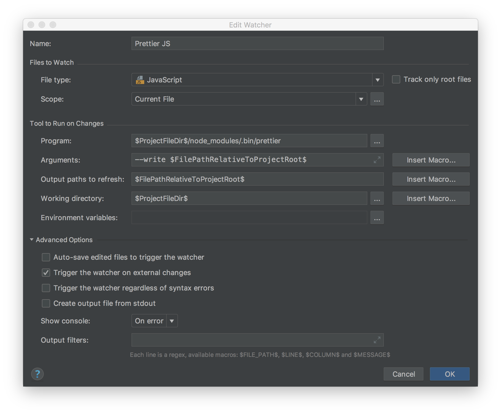

# Package Structure

- `bin/` is for any executable scripts, or compiled binaries used with, or built from your module.
- `build/` is for any scripts or tooling needed to build the project
- `dist/` is for compiled modules that can be used with other systems.
- `doc/` is for markdown documentation of the project and related concepts.
- `env/` is for any environment that is needed for testing
- `flow-typed/` has library definitions for flow. The `flow-typed/npm` files are generated or community-supplied files. Nevertheless, these files must be included in source control.
- `lib/` is the compiled (portable) library code that will be linked into dependent projects.
- `scripts/` is for any utility scripts used for development of the module.
- `src/` has the production source files. The files will be compiled by babel.
- `test/` has the project's tests
- `test/unit` is for unit tests. Its structure should parallel `/src`.
- `test/integration` is for integration tests.
- `var` collects build artifacts to be archived with the GitHub actions build, but not committed to source control or included with the release package.
- `var/coverage/test` istanbul code-coverage output, produced by `yarn test:unit`. Open `var/coverage/test/lcov-report/index.html` to see the detailed code-coverage report from the most recent test run.
- `var/coverage/flow` flow-coverage-report output, produced by `yarn flow:coverage-report`. Open `var/coverage/flow/index.html` to see the detailed code-coverage report from the most recent test run.

Prefer to organize subdirectories of `/src` as modules with cohesive purposes, instead of organizing by software design pattern. We should have "plant", "maintenance", "settings" modules instead of buckets of "components", "containers" and "reducers".

## Rationale

[The CommonJS package format outlines the directory structure of Node packages.](http://wiki.commonjs.org/wiki/Packages/1.0#Package_Directory_Layout) We follow the [convention](https://gist.github.com/tracker1/59f2c13044315f88bee9#lib--src) of organizing non-executable code in `/src`, reserving `/lib` for directly executable code. The `/lib` folder is not needed in this project.

Using a separate `src` and `test` directories aligns with our convention for `serverless` projects. While placing test files alongside production code is attractive because it improves cohesion within the project, the layout is incompatible with serverless-webpack.

Organization of the source tree into modules helps to reinforce the need for a cohesive code-base.

# Development Environment

## Chocolatey (Windows only)

The Chocolatey package manager ensures consistent development environment
construction in Windows. Chocolatey works with Powershell. Powershell must always be
started with administrator privilege. To install Chocolatey:

1.  Press the windows button and type "powershell".
2.  Right-click on "Windows PowerShell" and select "Run as Administrator".
3.  Check the execution policy by running `Get-ExecutionPolicy`.
4.  Set the policy by running `Set-ExecutionPolicy -ExecutionPolicy RemoteSigned`.
5.  Install Chocolatey:
    `iwr https://chocolatey.org/install.ps1 -UseBasicParsing | iex`.

## Node

This project targets Node 12.13.0 and higher. The same version should be used in each development environment, to minimize any friction due to differences between Node releases. The project uses babel to transform the source code for the target version of Node.

In Windows, install Node using Chocolatey from an administrator-privileged PowerShell terminal.

```ps
choco install nodejs --version 12.13.0 -y
```

In unix development environments, use the `n` node version manager. To install n:

```sh
curl -L https://git.io/n-install | bash
n 12
```

If you use zsh, add ~/n/bin to the PATH exported in zshrc.

## Yarn

The development environment requires the yarn package manager. This package manager provides a stable lock file
format when doing development work on multiple operating systems. Yarn ensure deterministic node package installation on
each platform. It is also faster than npm.

To install yarn in Windows, install yarn using choco: `choco install yarn -y` from an administrator-privileged
PowerShell terminal.

On OSX, [install yarn] using its installation script `curl -o- -L https://yarnpkg.com/install.sh | bash`. We do not use homebrew, since it does not work well with node version managers.

After checking out this repo and installing yarn, run `yarn` from the command-line to install the node package
dependencies.

[install yarn]: https://yarnpkg.com/en/docs/install#mac-stable

## WebStorm

WebStorm is our standard IDE due to its ability to debug and its seamlessly integration with ESLint. By standardizing the IDE, we can less focus on development environment and increase our productivity. Feel free to use VS Code, Sublime, or any editor of your choice as long as the configurations are consistent.

## Lint

We have standardized our linting practice using ESLint built on top of [Airbnb](https://github.com/airbnb/javascript) and Google's recommendations. See the ESLint file. We are constantly working to update the rules so feel free to update to this repo as you work on your projects.

## Prettier

Prettier is great at standardizing style, and since people will use different IDEs and editors, we included two setup files for prettier.

For WebStorm, you can import Prettier as a file watcher that triggers Prettier manually when you save with `cmd+S` by using the `watcher.xml` file.

For others, we've included a .prettierrc. It has not been extensively tested against different editors and IDEs, so feel free to add your experience here.

## Scripts

Several commands are defined by the package.json scripts.

`yarn test` runs the comprehensive set of automated tests. This includes the jest unit test, flow and eslint checks.

`yarn test:flow:status` checks for flow type and lint errors. It is one of the checks included in `yarn test`.

`yarn git:push` pushes commits and tags to GitHub.

`yarn test:jest` runs the jest unit tests. It is one of the checks included in `yarn test`.

`yarn lint` runs the ESLint check. It is one of the checks included in `yarn test`. Some lint errors can be automatically fixed by running `yarn lint --fix`.

`yarn publish:patch` publishes a "patch" release. It bumps the patch version number, tags the release and pushes the version and tag to GitHub. `yarn publish:minor` publishes a minor release. Similarly, `yarn publish:major` publishes a major release.

`yarn version:path` creates an unpublished patch release. The minor version number is bumped, committed and tagged, but not pushed to GitHub. `yarn version:minor` creates a minor release. Similarly, `yarn versio:major` creates an unpublished major release.

### Add Prettier to WebStorm

Open the WebStorm / Preferences dialog. Search for "File Watcher". Click the Import icon (with a green arrow). Add doc/prettier-watchers-pc.xml or -unix.xml depending on your operating system. Prettier will be triggered on JS files as you do `cmd+S` or switch focus to another window.

#### Manually configure Prettier to WebStorm

While **ESLint** can notify you about both code-quality and code-style within WebStorm, its fixing tool by itself is not quite fit for auto-formatting. This is why the project is also integrated **Prettier**, a code-formatting tool with strong auto-formatting feature.

Although **Prettier** can format through **ESLint**, having Prettier to automatically format file upon saving would definitely be a plus. You can do that in WebStorm by follow steps below:

First, ensure that all dependencies are installed:

```sh
yarn
```

Next, go to WebStorm > Preferences > Tools > File Watchers, and press the import icon. Load the file watchers from [prettier-watchers-unix.xml](prettier-watchers-unix.xml) or [prettier-watchers-pc.xml](prettier-watchers-pc.xml), depending on your system. Finally, save the changes. This configuration should apply Prettier to all supported file types.

Alternatively, add File Watchers one-by-one by pressing the "+" button and setting the following properties:

- Name: Prettier JS
- File Type: JavaScript
- Scope: Project Files
- Program:
  For Mac OS X or Linux: `$ProjectFileDir$/node_modules/.bin/prettier`
  For Windows: `$ProjectFileDir$/node_modules/.bin/prettier.cmd`
- Arguments: `--write $FilePathRelativeToProjectRoot$`
- Working Directory: `$ProjectFileDir$`
- Output Paths to Refresh: `$FilePathRelativeToProjectRoot$`
- Advanced Options: only select "Trigger the watcher on external change"
  

Then click "Apply".

To run Prettier on all supported files, run `yarn prettier`

For more information on the dependencies:
[eslint-plugin-prettier](https://github.com/prettier/eslint-plugin-prettier),
[eslint-config-prettier](https://github.com/prettier/eslint-config-prettier),
[Prettier](https://prettier.io/docs/en/webstorm.html),
[airbnb-base](https://www.npmjs.com/package/eslint-config-airbnb-base)

### Rationale

Prettier can be run as a pre-commit hook instead of a File Watcher. This can ensure formatting consistency while allowing developers the freedom to choose different IDEs. However, the pre-commit hook technique causes too much commit latency for larger projects (the pre-commit hook for TorqueDashboardApp with 160k sloc would add 10 seconds to the commit process). Therefore, we prefer to use the Webstorm file watcher via project-specific configuration.

A project-local installation is used, instead of a global installation. [Prettier recommends pinning an exact package version, because each patch release introduces new stylistic changes.](https://prettier.io/docs/en/install.html) The project-local installation of prettier avoids style thrashing when developing projects pinned to different versions of prettier.

The project Prettier configuration file is consistently used, instead of command-line configuration. Centralizing follows the "don't repeat yourself" rule of thumb. Centralization ensures that scripts, IDE configuration and any future method for invoking Prettier stay synchronized with the project's style standard.

## Flow

Flow is configured to use [flow-typed](https://github.com/flowtype/flow-typed) repository of libdefs (type definitions). These libdefs are be checked-into this repository because flow-typed libdefs are not pinned by a package version. It is undesirable to receive a new libdef for a dependency that has not changed, because [it could introduce a spurrious type-check failure.](https://github.com/flowtype/flow-typed/wiki/FAQs#why-do-i-need-to-commit-the-libdefs-that-flow-typed-installs-for-my-project) To maintain the flow-typed libdefs, run `yarn flow-typed install` after changing the package dependencies.

The eslint-plugin-flowtype package integrates ESLint with Flow.

The WebStorm IDE uses flow to improve navigation, code completion and type hinting. It can also show type-checking errors inline, just like syntax or lint errors. [Configure WebStorm for Flow](https://blog.jetbrains.com/webstorm/2016/11/using-flow-in-webstorm/) by using Preferences / Languages & Frameworks / Javascript. Set the language version to Flow and enable "Type checking". 

### Lint

[Flow’s linter](https://flow.org/en/docs/linting/) encourages developers to add tight type annotations. For example, it can be convenient to use the `any` type when a mock will only satisfy part of an interface. In this case, the tested function has an `Axios` instance argument, but we know that the function only really depends on a single method, `post`. When listing is enabled, we see a diagnostic for `any`. In this case, we can confirm that we think that we know what we’re doing by suppressing the lint diagnostic with a `flowlint-line` directive.

```js
const client: any = { post }; // flowlint-line unclear-type:off
```

### Build

Babel compiles the project to prepares Node-compatible javascript. The [babelrc](.babelrc.js) file configures the flow compiler and the target Node version, 12.13.0.

# Quality

High unit test coverage is essential for the sustainability of the software systems that we create. Unit test coverage gives us the ability to confidently refactor our software modules. High unit test coverage is a good indication that SOLID principles are being adhered to in the code-base; when getting test coverage for a module is hard, then it’s usually a sign that the module is serving more than one concern or is too tightly coupled to other modules. Test coverage is essential for software modules that will be reused in more than one context.

[Flow](https://flow.org/en/) is used to declare interface types. Libraries should use static type checking, because it provides users with helpful auto-completions in the IDE. These hints reduce typos and make it easier to discover the library's functionality and correctly use its interface. Type checking can also expose interface errors that are undetected in unit testing due to mocks.

To invoke the test suite, run `yarn test`. This runs ESLint, the Jest unit tests and the Flow type checker.

## ESLint

ESLint is used to enforce the [Airbnb Style Guid](https://github.com/airbnb/javascript). The burden of the style guidelines are eased through automated correction. The Prettier package helps the IDE automatically improve the formatting of the source code. The husky git hook automatically corrects some other ESLint issues when adding.

## Flow

The eslint-plugin-flowtype package integrates ESLint with Flow.

The WebStorm IDE uses flow to improve navigation, code completion and type hinting. It can also show type-checking errors inline, just like syntax or lint errors. [Configure WebStorm for Flow](https://blog.jetbrains.com/webstorm/2016/11/using-flow-in-webstorm/) by using Preferences / Languages & Frameworks / Javascript. Set the language version to Flow and enable "Type checking". 

### flow-typed

Community-built library definitions are provided by the [flow-typed](https://github.com/flowtype/flow-typed) package. These library definitions are be checked-into this repository under flow-typed/npm because flow-typed libdefs are not pinned by a package version. It is undesirable to receive a new libdef for a dependency that has not changed, because [it could introduce a spurrious type-check failure.](https://github.com/flowtype/flow-typed/wiki/FAQs#why-do-i-need-to-commit-the-libdefs-that-flow-typed-installs-for-my-project) To maintain the flow-typed libdefs, run `yarn flow-typed install` after changing the package dependencies.

### Lint

[Flow’s linter](https://flow.org/en/docs/linting/) encourages developers to add tight type annotations. For example, it can be convenient to use the `any` type when a mock will only satisfy part of an interface. In this case, the tested function has an `Axios` instance argument, but we know that the function only really depends on a single method, `post`. When listing is enabled, we see a diagnostic for `any`. In this case, we can confirm that we think that we know what we’re doing by suppressing the lint diagnostic with a `flowlint-line` directive.

```js
const client: any = { post }; // flowlint-line unclear-type:off
```

By default, lint is not enabled. Enable lint using [.flowconfig](.flowconfig):

```ini
[lints]
all=error
```

### Rationale

A problem with javascript is that unit tests are often narrowly mocked. This can keep the unit tests easy to write, very fast and avoids introducing too many details of the partners of the test subject. But the downside is that compliance to interfaces ends up not being checked until runtime. So flow type annotations allow the compiler to check whether the program adheres to a consistent set of interfaces.

It is relatively easy to learn to write the type annotations, and the diagnostic output of the flow compiler is helpful. This baseline configuration is quite picky, because the flow "linter" is enabled. Also, tests are type-checked and linted (working from the perspective that interface agreement is quite important in tests). The flow linter strongly encourages the developers to add type annotations everywhere where the type cannot be inferred. We'll need to reconsider whether the pickiness is tolerable after living with it for a few weeks. Since type-checking is not a native part of javascript, there tends to be more type friction around external libraries than there would be in a strongly typed language. The flow-typed library partially mitigates this friction.

## Jest

Jest is used to run tests. To execute the jest-based unit tests, run `yarn test:unit`. Complete unit test coverage is expected, and Jest is configured to fail if coverage is less than 100%. The tests should be written in a literate style, so that they help to document the intended behavior of the software. High test coverage gives confidence that the software works as intended.

The project is configured with a Continuous Integration server. The Continuous Integration server runs the tests and lint using the command yarn test. When AppVeyor is used for CI, the jest tests are reported to the test result collector.

## Continuous Integration

The project uses GitHub actions for Continuous Integration. The CI build run
the tests and lint using the command `yarn test`.

# Release

Releases are made from the master branch. To bump the version number and start the process of publishing a release, run `yarn publish:patch`. This will set the package.json version to the next patch number and push a
tagged commit, triggering the deployment process.

[JavaScript GitHub Actions require dependencies to be checked-in] to the repo. This package uses webpack to run the build process: transpile with babel and compile the distribution bundle. The steps to publish a new version are:
1. Run `yarn build` to compile the new version.
2. Commit any code changes along with `dist/main.js` (the webpack output).
3. Create a release tag by running `yarn publish:___` (`patch`, `minor` or `major`).
4. Check that the CI build passes.
5. In the GitHub web interface, navigate to the new tag. Create a release, enabling "Publish this Action to the GitHub Marketplace".

[JavaScript GitHub Actions require dependencies to be checked-in]: https://help.github.com/en/actions/automating-your-workflow-with-github-actions/creating-a-javascript-action#commit-and-push-your-action-to-github
